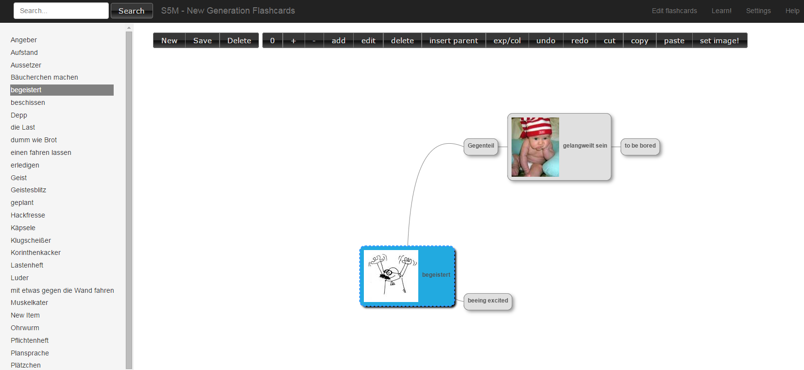

# s5m
## New Generation Flashcards. 

The web-app aims to combine the traditional way of learning using popular flashcards with another fast-learning method that uses associations of texts and images in form similar to mindmaps.
Traditional flashcards uses only textual information and human reason doesn't memorize it efficiently. Using the mindmap that associates the given term with related images and other words/terms is more natural for our brain.

## Installation:
with roxy:
- ml local bootstrap
- ml local deploy modules
- ml local deploy content
TODO:
- Algorithm for calculating the card repetition date (basing on the statistics of 'grades') - how good the card was memorized.
- Flashcard learning/test page (learn.html)
- (optional) textual analysis of topically similar cards (tf-idf), in order to propose the card that could be the continuation of the started topic (in drill mode) to have even more associations!
